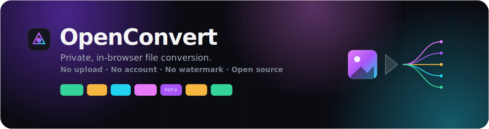

<div align="center">



### Convert images, audio, and video privately, right in your browser.

Nothing is uploaded. No account. No watermark. Open source, so the privacy is something you can verify instead of trust.

<a href="https://jmxsmith2-hash.github.io/openconvert/"></a>

<br/>


</div>

---

## Why it exists

In 2026 the [FBI](https://www.fbi.gov/contact-us/field-offices/denver/news/fbi-denver-warns-of-online-file-converter-scam) warned that many "free online file converter" sites harvest the files you upload or push malware. Even the honest ones send your private photos and clips to a server and ask you to trust a "deleted in an hour" promise you can't check.

OpenConvert does the conversion **on your device**, in a normal browser tab. Files are decoded, resized, and re-encoded in memory and never touch a network. Because the code is open and the whole thing is a static site you can self-host, "your files never leave your browser" is auditable, not a marketing line. Open your devtools network tab and watch: nothing goes out.

## What it converts

| Lane | Input | Output |
| --- | --- | --- |
| **Images** | HEIC · JPG · PNG · WebP · AVIF · GIF · BMP | JPEG · PNG · WebP · AVIF |
| **Audio** | MP3 · WAV · M4A · AAC · OGG · FLAC and more | MP3 · WAV · M4A · OGG |
| **Video** | MP4 · MOV · WebM · MKV · AVI and more | MP4 · WebM · GIF · or extract the audio |

Batch convert, tune quality, resize, then download files individually or as a ZIP. Metadata (including GPS/EXIF) is stripped automatically on re-encode.

You can also **compress to a target size** ("get this under 5 MB" and it finds the quality/bitrate for you), it runs **faster video** on a multi-threaded core where the browser allows it, and it **installs as an app** and works offline after the first visit.

## How it compares

|  | Typical online converters | Desktop apps | **OpenConvert** |
| --- | :---: | :---: | :---: |
| Files stay on your device | uploaded | yes | **yes** |
| No install | yes | no | **yes** |
| No account or paywall | often not | varies | **yes** |
| Open source | rarely | sometimes | **yes** |
| Works offline | no | yes | **after first load** |

## How it works

Everything runs client side:

- **Images** decode through the browser (with [`heic2any`](https://github.com/alexcorvi/heic2any)/libheif for HEIC), draw to an `OffscreenCanvas` for resizing, and encode via the native canvas or the [jSquash](https://github.com/jamsinclair/jSquash) (libavif) WebAssembly codec for AVIF.
- **Audio and video** run through a self-hosted, single-threaded [ffmpeg.wasm](https://github.com/ffmpegwasm/ffmpeg.wasm). The ~31 MB core is bundled with the app (no CDN) and **lazy loaded**, so image-only users never download it. Single-threaded means no `SharedArrayBuffer` and no cross-origin-isolation headers, so it runs anywhere, including GitHub Pages, with no service-worker tricks.

The trade-off is honest: encoding happens on your hardware, so long videos are slower than a server would be. That slowness is the price of never uploading, and it is the whole point.

## Run it locally

```bash
git clone https://github.com/jmxsmith2-hash/openconvert
cd openconvert
npm install
npm run dev      # http://localhost:5173
```

```bash
npm run build    # type-check + static build to dist/
npm run preview  # serve the production build
```

The output in `dist/` is a fully static site. Host it anywhere or open it offline.

## Tech

React 19 · TypeScript · Vite · Tailwind CSS v4 · jSquash · heic2any · ffmpeg.wasm · fflate · self-hosted Space Grotesk and Inter.

## Roadmap

- [x] Compress to a target size (images, audio, video)
- [x] Multi-threaded ffmpeg core for much faster video (service-worker cross-origin isolation)
- [x] Installable PWA with offline support
- [ ] Web Worker offload so large image batches never stutter
- [ ] Two-pass video for more precise target sizes
- [ ] More output formats and presets

## Contributing

PRs welcome. The conversion logic lives in [`src/lib/`](src/lib) (`convert.ts` for images, `ffmpeg.ts` + `media.ts` for audio/video) and is intentionally small. Adding a format is usually a few lines plus a UI entry.

## License

[MIT](LICENSE).
